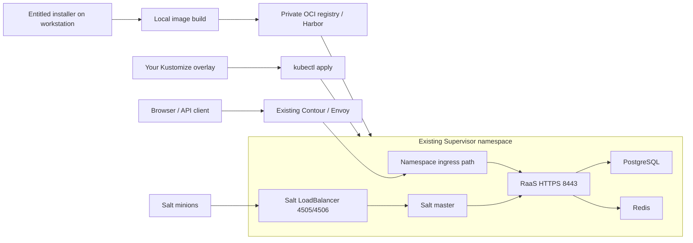

# SaltStack Config on vSphere Supervisor

Run SSC as containers directly in an existing vSphere Supervisor namespace.
The primary deployment target is native vSphere Pods. RaaS, Salt master,
PostgreSQL and Redis run without creating a VKS workload cluster.

## Two-phase workflow

| Phase | Work | Output |
| --- | --- | --- |
| 1. Build locally | Obtain the entitled Broadcom installer, stage its RPMs/wheel, build Linux amd64 images | Locally built RaaS and Salt master images; release provenance |
| 2. Deploy to Supervisor | Publish images to a private OCI registry, prepare platform services and namespace dependencies, configure certificates and apply Kustomize, validate SSC | Persistent SSC workloads deployed directly, HTTPS through Contour, Salt TCP endpoint |

Start with the [quick start](QUICKSTART.md), then follow the
[image build guide](images/README.md) and the
[Supervisor deployment guide](deployment/supervisor/README.md).
Local builds keep proprietary inputs out of this public repository. They do
not replace the operator's responsibility for installer entitlement, runtime
licensing and permitted private image distribution.

## Architecture

Harbor holds container images; kubectl applies your generated Kustomize overlay. An OCI
Helm chart or OCI-packaged manifest bundle is not required by this workflow.
The deployment generator supports direct Contour routing or an optional
LoadBalancer bridge for environments with separate pod networks.

## Bring your own environment

Edit [settings.example.json](deployment/supervisor/settings.example.json), then
run `python3 scripts/configure-supervisor.py --config .supervisor/settings.json`
to create your own Kustomize overlay and certificate bootstrap files. Follow the
[quick start](QUICKSTART.md) for the complete sequence.

Your namespace, storage policy, image references, DNS and certificate settings
belong in your generated configuration. These files are ignored by default;
review them and optionally track them in your own deployment repository. Secrets stay outside
Git. The public template contains no operator-specific deployment configuration.

Do not use root-level `kubectl apply -k .` for Supervisor: that remains the
local-development stack in `aria-config`.

## Repository map

- `images/`, `scripts/`, `bundle/`: local builds; proprietary payloads ignored.
- `deployment/supervisor/`: platform prerequisites, registry, deployment and operations.
- `deployment/supervisor/templates/`: generic workload and certificate templates.
- `deployment/environments/`: ignored generated configuration for your own Git repository.
- `scripts/configure-supervisor.py`, `scripts/check-supervisor.py`: generation and preflight.
- `scripts/contour-supervisor-backend.py`, `scripts/set-supervisor-dns.ps1`: optional routing/DNS helpers.
- `postgres/`, `redis/`, `raas/`, `salt-master/`, `storage/`: reusable components.
- `lab/compose/` and [alternative guides](deployment/README.md): local validation.

## Remaining work

The deployment is single-instance, not HA. Backup/restore rehearsal, repeatable
fresh-environment bootstrap, immutable image pinning, certificate renewal
validation, credential rotation and ongoing health monitoring remain explicit follow-up work. See the
[operations and gaps](deployment/supervisor/operations.md) for the full boundary.
The appliance's VIP localization service and an offline minion-distribution
workflow are not implemented here.

## Project and licensing boundary

This is an experimental lab/evaluation project with no vendor-support claim.
Repository code is MIT-licensed; Broadcom/VMware binaries retain their own
licensing terms and are not included in Git or published as public images.
